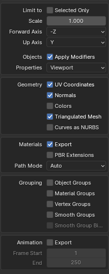

# Projekt OpenGL
Demo silnika graficznego napisanego w C#

Z uwagi że pliki sceny ważą ponad 1GB nie umieszczam ich w repozytorium, a podaje link do źródła i instrukcje importu.

Film demonstracyjny:

## Features:
* Ładowanie modeli wraz  z teksturami z pliku .obj
* System prouszania się kamerą w przestrzeni 3D
* Dynamiczne dostosowanie się aplikacji do szerokości i wysokości okna
* Tekstury sześcienne (Sky Boxy)
* Cieniowanie w modelu Blinna-Phonga
* Tekstury
* Specular Mapping
* Normal Mapping
* Gamma correction
* Dynamiczne przełączanie ustawień silnika za pomocą przycisków klawiatury
* Scena składająca się z:
* * 2,832,120 trójkątów
* * 203 tekstur albedo, normal i specular
* * 1591 unikatowych siatek
* Kompatybilność z wieloma systemami (Testowane na Windows i dystrybucji Linuxa)
* Kompatybilność z kartami/sterownikami NVIDIA i AMD

## Instalacja:
* Pobierz repozytorium
* Zainstaluj NuGety
* Pobierz [scenę](https://developer.nvidia.com/orca/amazon-lumberyard-bistro)
* Zaimportuj scęnę do Blendera
* Wyeksportuj scenę do pliku "bistro.obj" z poprawnymi ustawieniami i umieść ją w katalogu "models"
* 
* Przekonwertuj każdy plik .dds na plik .png z taką samą nazwą i umieść wszystkie w katalogu "Textures" (Polecam [ImageMagick](https://imagemagick.org/index.php))
* Uruchom projekt

## Sterowanie
| Klawisz              | Akcja                                 |
|----------------------|---------------------------------------|
| W                    | Idź do przodu                         |
| S                    | Idź do tyłu                           |
| A                    | Idź w lewo                            |
| D                    | Idź w prawo                           |
| Spacja               | Idź w górę                            |
| LCtrl                | Idź w dół                             |
| LShift               | Modyfikator szybkości prousznia się   |
| Scroll myszki w górę | Zmniejsz FOV kamery                   |
| Scroll myszki w dół  | Zwiększ FOV kamery                    |
| TAB                  | Zwolnij kurosr i wstrzymaj symulację  |
| T                    | Przełącz użycie tekstur               |
| N                    | Przełącz użycie map normalnych        |
| M                    | Przełącz użycie map spekularnych      |
| B                    | Przełącz użycie sky boxa              |
| L                    | Przełącz użycie światła i cieniowania |

## Korzystanie z OpenGL w języku C#
* Utwórz nową aplikację konsolową .NET w IDE twojego wyboru.
* Zainstaluj NuGety:
*  * [OpenTK](https://www.nuget.org/packages/OpenTK)
*  * [StbImageSharp](https://www.nuget.org/packages/StbImageSharp)
* Postępuj zgodnie z [dokumentacją OpenTK](https://opentk.net/learn/index.html) (Pierwsze kilka tematów z zajęć się pokrywa)